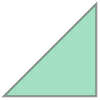
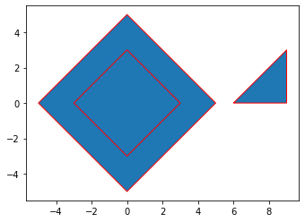
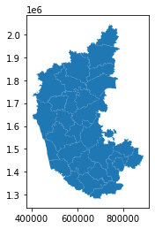

## Shapely Geometry Objects


```python
#https://shapely.readthedocs.io/en/stable/manual.html
import shapely.geometry
```


```python
#Creation of shapely geometry point object
point1 = shapely.geometry.Point(0,0)
```


```python
point1
```


    

    


```python
#Creation of shapely geometry multi point object
multipoint1 = shapely.geometry.MultiPoint([(-2,0),(2,0),(1,1)])
multipoint1
```


    

    


```python
#Creation of shapely geometry linestring object
line1 = shapely.geometry.LineString([(0,0),(2,0),(3,3),(0,5)])
line1
```


    

    


```python
line2 = shapely.geometry.LineString([(-3,0),(0,2),(2,5)])
line2
```


    

    


```python
#Creation of shapely geometry multiline string object
multiline1 = shapely.geometry.MultiLineString([line1,line2])
multiline1
```


    

    


```python
#Creation of shapely geometry polygon object
polygon1 = shapely.geometry.Polygon([(3,0),(0,3),(-3,0),(0,-3),(3,0)])
polygon1
```


    

    


```python
polygon2 = shapely.geometry.Polygon([(5,0),(0,5),(-5,0),(0,-5),(5,0)])
polygon2
```


    

    


```python
#Creation of shapely geometry polygon object with a hole/interior border
polygon3 = shapely.geometry.Polygon([(5,0),(0,5),(-5,0),(0,-5),(5,0)],[[(3,0),(0,3),(-3,0),(0,-3),(3,0)]])
polygon3
```


    

    


```python
polygon4 = shapely.geometry.Polygon([(6,0),(9,0),(9,3)])
polygon4
```


    

    


```python
#Creation of shapely geometry multipolygon object
multipolygon1 = shapely.geometry.MultiPolygon([polygon3,polygon4])
multipolygon1
```


    

    


```python
# type of shapely geometry object using geom-type attribute
point1.geom_type
```


    'Point'


```python
line1.geom_type
```


    'LineString'


```python
#coords attribue of shapely geometry object
point1.coords
```


    <shapely.coords.CoordinateSequence at 0x227efcea0a0>


```python
#listing of coordinates of shapely geometry object
list(point1.coords)
```


    [(0.0, 0.0)]


```python
list(line1.coords)
```


    [(0.0, 0.0), (2.0, 0.0), (3.0, 3.0), (0.0, 5.0)]


```python
#number of linestring components of a multiline string using len() method
len(multiline1.geoms)
```


    2


```python
#listing of coordinates of a component of shapely geometry object
list(multiline1.geoms[0].coords)
```


    [(0.0, 0.0), (2.0, 0.0), (3.0, 3.0), (0.0, 5.0)]


```python
list(multiline1.geoms[1].coords)
```


    [(-3.0, 0.0), (0.0, 2.0), (2.0, 5.0)]


```python
#Check whether the polygon has interior border/hole
len(polygon1.interiors)
```


    0


```python
#listing of coordinates of the exterior border of the shapely geometry polygon object
list(polygon1.exterior.coords)
```


    [(3.0, 0.0), (0.0, 3.0), (-3.0, 0.0), (0.0, -3.0), (3.0, 0.0)]


```python
#Check the number of interior borders/holes of a shapely geometry polygon object
len(polygon3.interiors)
```


    1


```python
#listing of coordinates of the interior border of the polygon
list(polygon3.interiors[0].coords)
```


    [(3.0, 0.0), (0.0, 3.0), (-3.0, 0.0), (0.0, -3.0), (3.0, 0.0)]


```python
#number of polygon components in a multipolygon through len() method
len(multipolygon1.geoms)
```


    2


```python
#number of interiors of the first component of multipolygon
len(multipolygon1.geoms[0].interiors)
```


    1


```python
#listing of coordinates of the exterior border of a component of multipolygon 
list(multipolygon1.geoms[0].exterior.coords)
```


    [(5.0, 0.0), (0.0, 5.0), (-5.0, 0.0), (0.0, -5.0), (5.0, 0.0)]


```python
#listing of coordinates of the interior border of a component of multipolygon 
list(multipolygon1.geoms[0].interiors[0].coords)
```


    [(3.0, 0.0), (0.0, 3.0), (-3.0, 0.0), (0.0, -3.0), (3.0, 0.0)]


```python
#check the type of shapely geometry object through geom_type() method
multipolygon1.geom_type
```


    'MultiPolygon'


```python
print(point1)
```

    POINT (0 0)
    


```python
print(line1)
```

    LINESTRING (0 0, 2 0, 3 3, 0 5)
    


```python
print(polygon1)
```

    POLYGON ((3 0, 0 3, -3 0, 0 -3, 3 0))
    


```python
print(polygon3)
```

    POLYGON ((5 0, 0 5, -5 0, 0 -5, 5 0), (3 0, 0 3, -3 0, 0 -3, 3 0))
    


```python
print(multipolygon1)
```

    MULTIPOLYGON (((5 0, 0 5, -5 0, 0 -5, 5 0), (3 0, 0 3, -3 0, 0 -3, 3 0)), ((6 0, 9 0, 9 3, 6 0)))
    


```python
#bounds attribute of shapely geometry polygon object
polygon1.bounds
```


    (-3.0, -3.0, 3.0, 3.0)


```python
#length attribute of a shapely geometry linestring object
line1.length
```


    8.76782893563237


```python
#length of multiline string gives the sum of lengths of all linestrings
multiline1.length
```


    15.978931486560349


```python
multiline1.geoms[0].length
```


    8.76782893563237


```python
multiline1.geoms[1].length
```


    7.211102550927978


```python
multiline1.length == (multiline1.geoms[0].length + multiline1.geoms[1].length)
```


    True


```python
#area attribute of shapely geometry polygon object
polygon2.area
```


    50.0


```python
polygon3.area
```


    32.0


```python
polygon1.area
```


    18.0


```python
#centroid attribute of polygon creates a point geometry object
polygon1.centroid
```


    

    


```python
type(polygon1.centroid)
```


    shapely.geometry.point.Point


```python
print(polygon1.centroid)
```

    POINT (0 0)
    


```python
#buffer of a point geometry 
point1.buffer(5)
```


    

    


```python
#buffer of a line geometry 
line1.buffer(1)
```


    

    


```python
#Creation of Geometry Collection. A Geometry Collection can include any type of shapely geometry object
collection1 = shapely.geometry.GeometryCollection([point1,line1,multipolygon1])
collection1
```


    

    


```python
type(collection1)
```


    shapely.geometry.collection.GeometryCollection


```python
print(collection1)
```

    GEOMETRYCOLLECTION (POINT (0 0), LINESTRING (0 0, 2 0, 3 3, 0 5), MULTIPOLYGON (((5 0, 0 5, -5 0, 0 -5, 5 0), (3 0, 0 3, -3 0, 0 -3, 3 0)), ((6 0, 9 0, 9 3, 6 0))))
    


```python
#check whether two shapely geometry objects intersect
point1.intersects(line1)
```


    True


```python
#check whether two shapely linestring objects cross each other
line1.crosses(line2)
```


    True


```python
#distance between intersecting gemometric objects is zero
point1.distance(line1)
```


    0.0


```python
#distance() gives the shortest distance between shapely geometry objects
polygon3.distance(polygon4)
```


    1.0


## Creation of GeoDataFrame from scratch


```python
polygon3
```


    

    


```python
polygon4
```


    

    


```python
gdf_dict = {"name":['polygon3','polygon4'], "geometry":[polygon3,polygon4]}
```


```python
import pandas as pd
import geopandas as gpd
```


```python
#creation of a GeoDataFrame through dictionary of lists with intended column headers as keys 
#GeoDataFrame should necessarily contain geometry column
gdf = gpd.GeoDataFrame(gdf_dict,crs=4326)
```


```python
gdf
```


<div>
<style scoped>
    .dataframe tbody tr th:only-of-type {
        vertical-align: middle;
    }

    .dataframe tbody tr th {
        vertical-align: top;
    }

    .dataframe thead th {
        text-align: right;
    }
</style>
<table border="1" class="dataframe">
  <thead>
    <tr style="text-align: right;">
      <th></th>
      <th>name</th>
      <th>geometry</th>
    </tr>
  </thead>
  <tbody>
    <tr>
      <th>0</th>
      <td>polygon3</td>
      <td>POLYGON ((5.00000 0.00000, 0.00000 5.00000, -5...</td>
    </tr>
    <tr>
      <th>1</th>
      <td>polygon4</td>
      <td>POLYGON ((6.00000 0.00000, 9.00000 0.00000, 9....</td>
    </tr>
  </tbody>
</table>
</div>


```python
type(gdf)
```


    geopandas.geodataframe.GeoDataFrame


```python
gdf['name']
```


    0    polygon3
    1    polygon4
    Name: name, dtype: object


```python
type(gdf['name'])
```


    pandas.core.series.Series


```python
gdf['geometry']
```


    0    POLYGON ((5.00000 0.00000, 0.00000 5.00000, -5...
    1    POLYGON ((6.00000 0.00000, 9.00000 0.00000, 9....
    Name: geometry, dtype: geometry


```python
type(gdf['geometry'])
```


    geopandas.geoseries.GeoSeries


```python
gdf['geometry'].iloc[0]
```


    

    


```python
#crs attribute of a GeoDataFrame gives information about the coordinate reference system
gdf.crs
```


    <Geographic 2D CRS: EPSG:4326>
    Name: WGS 84
    Axis Info [ellipsoidal]:
    - Lat[north]: Geodetic latitude (degree)
    - Lon[east]: Geodetic longitude (degree)
    Area of Use:
    - name: World.
    - bounds: (-180.0, -90.0, 180.0, 90.0)
    Datum: World Geodetic System 1984 ensemble
    - Ellipsoid: WGS 84
    - Prime Meridian: Greenwich


```python
#visualisation of the geodataframe geometry 
gdf.plot(color)
```


    ---------------------------------------------------------------------------

    NameError                                 Traceback (most recent call last)

    ~\AppData\Local\Temp/ipykernel_15836/2138492524.py in <module>
          1 #visualisation of the geodataframe geometry
    ----> 2 gdf.plot(color)
    

    NameError: name 'color' is not defined


```python
gdf.plot(edgecolor = 'red')
```


    <AxesSubplot:>


    

    


## Reading of data from a vector file and creation of a GeoDataFrame


```python
import pathlib
import os
```


```python
#creation of file path to vector file
fp = pathlib.Path.home() / 'PythonWRM' / 'Data' / 'Karnataka_Districts'/'District.shp'
```


```python
help(gpd.read_file)
```

    Help on function _read_file in module geopandas.io.file:
    
    _read_file(filename, bbox=None, mask=None, rows=None, **kwargs)
        Returns a GeoDataFrame from a file or URL.
        
        .. versionadded:: 0.7.0 mask, rows
        
        Parameters
        ----------
        filename : str, path object or file-like object
            Either the absolute or relative path to the file or URL to
            be opened, or any object with a read() method (such as an open file
            or StringIO)
        bbox : tuple | GeoDataFrame or GeoSeries | shapely Geometry, default None
            Filter features by given bounding box, GeoSeries, GeoDataFrame or a
            shapely geometry. CRS mis-matches are resolved if given a GeoSeries
            or GeoDataFrame. Cannot be used with mask.
        mask : dict | GeoDataFrame or GeoSeries | shapely Geometry, default None
            Filter for features that intersect with the given dict-like geojson
            geometry, GeoSeries, GeoDataFrame or shapely geometry.
            CRS mis-matches are resolved if given a GeoSeries or GeoDataFrame.
            Cannot be used with bbox.
        rows : int or slice, default None
            Load in specific rows by passing an integer (first `n` rows) or a
            slice() object.
        **kwargs :
            Keyword args to be passed to the `open` or `BytesCollection` method
            in the fiona library when opening the file. For more information on
            possible keywords, type:
            ``import fiona; help(fiona.open)``
        
        Examples
        --------
        >>> df = geopandas.read_file("nybb.shp")  # doctest: +SKIP
        
        Specifying layer of GPKG:
        
        >>> df = geopandas.read_file("file.gpkg", layer='cities')  # doctest: +SKIP
        
        Reading only first 10 rows:
        
        >>> df = geopandas.read_file("nybb.shp", rows=10)  # doctest: +SKIP
        
        Reading only geometries intersecting ``mask``:
        
        >>> df = geopandas.read_file("nybb.shp", mask=polygon)  # doctest: +SKIP
        
        Reading only geometries intersecting ``bbox``:
        
        >>> df = geopandas.read_file("nybb.shp", bbox=(0, 10, 0, 20))  # doctest: +SKIP
        
        Returns
        -------
        :obj:`geopandas.GeoDataFrame` or :obj:`pandas.DataFrame` :
            If `ignore_geometry=True` a :obj:`pandas.DataFrame` will be returned.
        
        Notes
        -----
        The format drivers will attempt to detect the encoding of your data, but
        may fail. In this case, the proper encoding can be specified explicitly
        by using the encoding keyword parameter, e.g. ``encoding='utf-8'``.
    
    


```python
#Reading of Vector Data file using read_file() method of GeoPandas
#read_file() can handle a variety of file formats
gdf_dists= gpd.read_file(fp)
```


```python
type(gdf_dists)
```


    geopandas.geodataframe.GeoDataFrame


```python
gdf_dists
```


<div>
<style scoped>
    .dataframe tbody tr th:only-of-type {
        vertical-align: middle;
    }

    .dataframe tbody tr th {
        vertical-align: top;
    }

    .dataframe thead th {
        text-align: right;
    }
</style>
<table border="1" class="dataframe">
  <thead>
    <tr style="text-align: right;">
      <th></th>
      <th>OBJECTID</th>
      <th>KGISDistri</th>
      <th>KGISDist_1</th>
      <th>BhuCodeDis</th>
      <th>created_us</th>
      <th>created_da</th>
      <th>last_edite</th>
      <th>last_edi_1</th>
      <th>SHAPE_STAr</th>
      <th>SHAPE_STLe</th>
      <th>geometry</th>
    </tr>
  </thead>
  <tbody>
    <tr>
      <th>0</th>
      <td>1</td>
      <td>01</td>
      <td>Belagavi</td>
      <td>01</td>
      <td>None</td>
      <td>None</td>
      <td>SA</td>
      <td>2021-08-02</td>
      <td>1.339907e+10</td>
      <td>1.142592e+06</td>
      <td>MULTIPOLYGON (((543129.127 1751479.278, 543112...</td>
    </tr>
    <tr>
      <th>1</th>
      <td>2</td>
      <td>02</td>
      <td>Bagalkot</td>
      <td>02</td>
      <td>None</td>
      <td>None</td>
      <td>SA</td>
      <td>2021-11-23</td>
      <td>6.561927e+09</td>
      <td>6.685005e+05</td>
      <td>POLYGON ((549213.306 1814907.479, 549215.074 1...</td>
    </tr>
    <tr>
      <th>2</th>
      <td>3</td>
      <td>03</td>
      <td>Vijayapura</td>
      <td>03</td>
      <td>None</td>
      <td>None</td>
      <td>SA</td>
      <td>2021-11-23</td>
      <td>1.050304e+10</td>
      <td>7.032299e+05</td>
      <td>POLYGON ((549213.306 1814907.479, 549141.052 1...</td>
    </tr>
    <tr>
      <th>3</th>
      <td>4</td>
      <td>04</td>
      <td>Kalburgi</td>
      <td>04</td>
      <td>None</td>
      <td>None</td>
      <td>SA</td>
      <td>2020-11-09</td>
      <td>1.097529e+10</td>
      <td>9.164460e+05</td>
      <td>MULTIPOLYGON (((680658.578 1957069.034, 680648...</td>
    </tr>
    <tr>
      <th>4</th>
      <td>5</td>
      <td>05</td>
      <td>Bidar</td>
      <td>05</td>
      <td>None</td>
      <td>None</td>
      <td>SA</td>
      <td>2021-09-15</td>
      <td>5.453756e+09</td>
      <td>5.745259e+05</td>
      <td>MULTIPOLYGON (((771900.212 1995911.630, 772192...</td>
    </tr>
    <tr>
      <th>5</th>
      <td>6</td>
      <td>06</td>
      <td>Raichur</td>
      <td>06</td>
      <td>None</td>
      <td>None</td>
      <td>SA</td>
      <td>2021-11-09</td>
      <td>8.468702e+09</td>
      <td>5.521036e+05</td>
      <td>POLYGON ((707232.021 1742209.646, 707220.764 1...</td>
    </tr>
    <tr>
      <th>6</th>
      <td>7</td>
      <td>07</td>
      <td>Koppal</td>
      <td>07</td>
      <td>None</td>
      <td>None</td>
      <td>SA</td>
      <td>2021-08-23</td>
      <td>5.576426e+09</td>
      <td>5.481392e+05</td>
      <td>POLYGON ((605959.047 1675240.530, 605954.992 1...</td>
    </tr>
    <tr>
      <th>7</th>
      <td>8</td>
      <td>08</td>
      <td>Gadag</td>
      <td>08</td>
      <td>None</td>
      <td>None</td>
      <td>SA</td>
      <td>2021-08-17</td>
      <td>4.655107e+09</td>
      <td>5.696709e+05</td>
      <td>POLYGON ((564411.280 1653561.980, 564410.639 1...</td>
    </tr>
    <tr>
      <th>8</th>
      <td>9</td>
      <td>09</td>
      <td>Dharwad</td>
      <td>09</td>
      <td>None</td>
      <td>None</td>
      <td>SA</td>
      <td>2021-01-06</td>
      <td>4.254719e+09</td>
      <td>4.783731e+05</td>
      <td>POLYGON ((491003.724 1662606.699, 490956.709 1...</td>
    </tr>
    <tr>
      <th>9</th>
      <td>10</td>
      <td>10</td>
      <td>Uttara Kannada</td>
      <td>10</td>
      <td>None</td>
      <td>None</td>
      <td>SA</td>
      <td>2021-12-16</td>
      <td>1.029688e+10</td>
      <td>8.021013e+05</td>
      <td>MULTIPOLYGON (((426063.811 1608219.137, 426050...</td>
    </tr>
    <tr>
      <th>10</th>
      <td>11</td>
      <td>11</td>
      <td>Haveri</td>
      <td>11</td>
      <td>None</td>
      <td>None</td>
      <td>SA</td>
      <td>2021-11-19</td>
      <td>4.817622e+09</td>
      <td>4.834372e+05</td>
      <td>POLYGON ((584299.945 1604936.206, 584288.888 1...</td>
    </tr>
    <tr>
      <th>11</th>
      <td>12</td>
      <td>12</td>
      <td>Ballari</td>
      <td>12</td>
      <td>None</td>
      <td>None</td>
      <td>SA</td>
      <td>2021-11-09</td>
      <td>9.893878e+09</td>
      <td>7.717999e+05</td>
      <td>POLYGON ((706352.146 1740384.134, 706368.210 1...</td>
    </tr>
    <tr>
      <th>12</th>
      <td>13</td>
      <td>13</td>
      <td>Chitradurga</td>
      <td>13</td>
      <td>None</td>
      <td>None</td>
      <td>SA</td>
      <td>2021-08-02</td>
      <td>8.434730e+09</td>
      <td>6.864730e+05</td>
      <td>POLYGON ((680478.110 1646590.894, 680479.264 1...</td>
    </tr>
    <tr>
      <th>13</th>
      <td>14</td>
      <td>14</td>
      <td>Davanagere</td>
      <td>14</td>
      <td>None</td>
      <td>None</td>
      <td>SA</td>
      <td>2021-11-19</td>
      <td>4.479603e+09</td>
      <td>5.433953e+05</td>
      <td>POLYGON ((584271.312 1604945.109, 584299.945 1...</td>
    </tr>
    <tr>
      <th>14</th>
      <td>15</td>
      <td>15</td>
      <td>Shivamogga</td>
      <td>15</td>
      <td>None</td>
      <td>None</td>
      <td>SA</td>
      <td>2021-02-22</td>
      <td>8.472464e+09</td>
      <td>7.777055e+05</td>
      <td>POLYGON ((512503.863 1487901.432, 512523.888 1...</td>
    </tr>
    <tr>
      <th>15</th>
      <td>16</td>
      <td>16</td>
      <td>Udupi</td>
      <td>16</td>
      <td>None</td>
      <td>None</td>
      <td>SA</td>
      <td>2021-10-04</td>
      <td>3.571363e+09</td>
      <td>3.947347e+05</td>
      <td>MULTIPOLYGON (((469819.343 1468444.326, 469803...</td>
    </tr>
    <tr>
      <th>16</th>
      <td>17</td>
      <td>17</td>
      <td>Chikkamagaluru</td>
      <td>17</td>
      <td>None</td>
      <td>None</td>
      <td>SA</td>
      <td>2021-09-21</td>
      <td>7.209587e+09</td>
      <td>6.098845e+05</td>
      <td>POLYGON ((625078.407 1488187.157, 624943.604 1...</td>
    </tr>
    <tr>
      <th>17</th>
      <td>18</td>
      <td>18</td>
      <td>Tumakuru</td>
      <td>18</td>
      <td>None</td>
      <td>None</td>
      <td>SA</td>
      <td>2021-11-30</td>
      <td>1.060356e+10</td>
      <td>1.103916e+06</td>
      <td>MULTIPOLYGON (((731573.628 1422546.639, 731586...</td>
    </tr>
    <tr>
      <th>18</th>
      <td>19</td>
      <td>19</td>
      <td>Kolara</td>
      <td>19</td>
      <td>None</td>
      <td>None</td>
      <td>SA</td>
      <td>2021-12-03</td>
      <td>3.990059e+09</td>
      <td>5.179988e+05</td>
      <td>POLYGON ((823437.923 1472025.135, 823437.951 1...</td>
    </tr>
    <tr>
      <th>19</th>
      <td>20</td>
      <td>20</td>
      <td>Bengaluru (Urban)</td>
      <td>20</td>
      <td>None</td>
      <td>None</td>
      <td>SA</td>
      <td>2021-09-01</td>
      <td>2.195805e+09</td>
      <td>3.445648e+05</td>
      <td>MULTIPOLYGON (((759983.568 1451201.068, 759972...</td>
    </tr>
    <tr>
      <th>20</th>
      <td>21</td>
      <td>21</td>
      <td>Bengaluru (Rural)</td>
      <td>21</td>
      <td>None</td>
      <td>None</td>
      <td>SA</td>
      <td>2021-09-09</td>
      <td>2.300531e+09</td>
      <td>5.181853e+05</td>
      <td>POLYGON ((793760.210 1479161.651, 793868.389 1...</td>
    </tr>
    <tr>
      <th>21</th>
      <td>22</td>
      <td>22</td>
      <td>Mandya</td>
      <td>22</td>
      <td>None</td>
      <td>None</td>
      <td>SA</td>
      <td>2021-12-02</td>
      <td>4.955494e+09</td>
      <td>5.712499e+05</td>
      <td>MULTIPOLYGON (((673159.512 1426651.207, 673209...</td>
    </tr>
    <tr>
      <th>22</th>
      <td>23</td>
      <td>23</td>
      <td>Hassan</td>
      <td>23</td>
      <td>None</td>
      <td>None</td>
      <td>SA</td>
      <td>2021-12-02</td>
      <td>6.818572e+09</td>
      <td>6.723690e+05</td>
      <td>POLYGON ((673209.742 1426692.229, 673159.512 1...</td>
    </tr>
    <tr>
      <th>23</th>
      <td>24</td>
      <td>24</td>
      <td>Dakshina Kannada</td>
      <td>24</td>
      <td>None</td>
      <td>None</td>
      <td>SA</td>
      <td>2020-11-10</td>
      <td>4.844944e+09</td>
      <td>4.987643e+05</td>
      <td>POLYGON ((553195.638 1377456.225, 553166.517 1...</td>
    </tr>
    <tr>
      <th>24</th>
      <td>25</td>
      <td>25</td>
      <td>Kodagu</td>
      <td>25</td>
      <td>None</td>
      <td>None</td>
      <td>SA</td>
      <td>2020-12-14</td>
      <td>4.113394e+09</td>
      <td>4.965497e+05</td>
      <td>POLYGON ((607827.104 1319014.771, 607707.156 1...</td>
    </tr>
    <tr>
      <th>25</th>
      <td>26</td>
      <td>26</td>
      <td>Mysuru</td>
      <td>26</td>
      <td>None</td>
      <td>None</td>
      <td>SA</td>
      <td>2021-09-23</td>
      <td>6.310566e+09</td>
      <td>7.040286e+05</td>
      <td>POLYGON ((653539.833 1306510.513, 653536.833 1...</td>
    </tr>
    <tr>
      <th>26</th>
      <td>27</td>
      <td>27</td>
      <td>Chamarajanagara</td>
      <td>27</td>
      <td>None</td>
      <td>None</td>
      <td>SA</td>
      <td>2021-09-23</td>
      <td>5.639260e+09</td>
      <td>6.017599e+05</td>
      <td>POLYGON ((653539.833 1306510.513, 653541.809 1...</td>
    </tr>
    <tr>
      <th>27</th>
      <td>28</td>
      <td>28</td>
      <td>Chikkaballapura</td>
      <td>29</td>
      <td>None</td>
      <td>None</td>
      <td>SA</td>
      <td>2021-12-03</td>
      <td>4.251074e+09</td>
      <td>5.151938e+05</td>
      <td>POLYGON ((834461.073 1510451.408, 834546.890 1...</td>
    </tr>
    <tr>
      <th>28</th>
      <td>29</td>
      <td>29</td>
      <td>Ramanagara</td>
      <td>28</td>
      <td>None</td>
      <td>None</td>
      <td>SA</td>
      <td>2021-11-30</td>
      <td>3.527706e+09</td>
      <td>4.891832e+05</td>
      <td>MULTIPOLYGON (((733208.816 1421119.027, 733210...</td>
    </tr>
    <tr>
      <th>29</th>
      <td>30</td>
      <td>30</td>
      <td>Yadgir</td>
      <td>30</td>
      <td>None</td>
      <td>None</td>
      <td>SA</td>
      <td>2020-11-09</td>
      <td>5.275414e+09</td>
      <td>5.550446e+05</td>
      <td>POLYGON ((642515.921 1790628.404, 642515.826 1...</td>
    </tr>
  </tbody>
</table>
</div>


```python
#listing of column header values of a GeoDataFrame as an array
gdf_dists.columns.values
```


    array(['OBJECTID', 'KGISDistri', 'KGISDist_1', 'BhuCodeDis', 'created_us',
           'created_da', 'last_edite', 'last_edi_1', 'SHAPE_STAr',
           'SHAPE_STLe', 'geometry'], dtype=object)


```python
#Selection of columns of a GeoDataFrame by passing a list 
gdf_dists_filtered = gdf_dists[['OBJECTID','KGISDist_1','geometry']]
```


```python
gdf_dists_filtered
```


<div>
<style scoped>
    .dataframe tbody tr th:only-of-type {
        vertical-align: middle;
    }

    .dataframe tbody tr th {
        vertical-align: top;
    }

    .dataframe thead th {
        text-align: right;
    }
</style>
<table border="1" class="dataframe">
  <thead>
    <tr style="text-align: right;">
      <th></th>
      <th>OBJECTID</th>
      <th>KGISDist_1</th>
      <th>geometry</th>
    </tr>
  </thead>
  <tbody>
    <tr>
      <th>0</th>
      <td>1</td>
      <td>Belagavi</td>
      <td>MULTIPOLYGON (((543129.127 1751479.278, 543112...</td>
    </tr>
    <tr>
      <th>1</th>
      <td>2</td>
      <td>Bagalkot</td>
      <td>POLYGON ((549213.306 1814907.479, 549215.074 1...</td>
    </tr>
    <tr>
      <th>2</th>
      <td>3</td>
      <td>Vijayapura</td>
      <td>POLYGON ((549213.306 1814907.479, 549141.052 1...</td>
    </tr>
    <tr>
      <th>3</th>
      <td>4</td>
      <td>Kalburgi</td>
      <td>MULTIPOLYGON (((680658.578 1957069.034, 680648...</td>
    </tr>
    <tr>
      <th>4</th>
      <td>5</td>
      <td>Bidar</td>
      <td>MULTIPOLYGON (((771900.212 1995911.630, 772192...</td>
    </tr>
    <tr>
      <th>5</th>
      <td>6</td>
      <td>Raichur</td>
      <td>POLYGON ((707232.021 1742209.646, 707220.764 1...</td>
    </tr>
    <tr>
      <th>6</th>
      <td>7</td>
      <td>Koppal</td>
      <td>POLYGON ((605959.047 1675240.530, 605954.992 1...</td>
    </tr>
    <tr>
      <th>7</th>
      <td>8</td>
      <td>Gadag</td>
      <td>POLYGON ((564411.280 1653561.980, 564410.639 1...</td>
    </tr>
    <tr>
      <th>8</th>
      <td>9</td>
      <td>Dharwad</td>
      <td>POLYGON ((491003.724 1662606.699, 490956.709 1...</td>
    </tr>
    <tr>
      <th>9</th>
      <td>10</td>
      <td>Uttara Kannada</td>
      <td>MULTIPOLYGON (((426063.811 1608219.137, 426050...</td>
    </tr>
    <tr>
      <th>10</th>
      <td>11</td>
      <td>Haveri</td>
      <td>POLYGON ((584299.945 1604936.206, 584288.888 1...</td>
    </tr>
    <tr>
      <th>11</th>
      <td>12</td>
      <td>Ballari</td>
      <td>POLYGON ((706352.146 1740384.134, 706368.210 1...</td>
    </tr>
    <tr>
      <th>12</th>
      <td>13</td>
      <td>Chitradurga</td>
      <td>POLYGON ((680478.110 1646590.894, 680479.264 1...</td>
    </tr>
    <tr>
      <th>13</th>
      <td>14</td>
      <td>Davanagere</td>
      <td>POLYGON ((584271.312 1604945.109, 584299.945 1...</td>
    </tr>
    <tr>
      <th>14</th>
      <td>15</td>
      <td>Shivamogga</td>
      <td>POLYGON ((512503.863 1487901.432, 512523.888 1...</td>
    </tr>
    <tr>
      <th>15</th>
      <td>16</td>
      <td>Udupi</td>
      <td>MULTIPOLYGON (((469819.343 1468444.326, 469803...</td>
    </tr>
    <tr>
      <th>16</th>
      <td>17</td>
      <td>Chikkamagaluru</td>
      <td>POLYGON ((625078.407 1488187.157, 624943.604 1...</td>
    </tr>
    <tr>
      <th>17</th>
      <td>18</td>
      <td>Tumakuru</td>
      <td>MULTIPOLYGON (((731573.628 1422546.639, 731586...</td>
    </tr>
    <tr>
      <th>18</th>
      <td>19</td>
      <td>Kolara</td>
      <td>POLYGON ((823437.923 1472025.135, 823437.951 1...</td>
    </tr>
    <tr>
      <th>19</th>
      <td>20</td>
      <td>Bengaluru (Urban)</td>
      <td>MULTIPOLYGON (((759983.568 1451201.068, 759972...</td>
    </tr>
    <tr>
      <th>20</th>
      <td>21</td>
      <td>Bengaluru (Rural)</td>
      <td>POLYGON ((793760.210 1479161.651, 793868.389 1...</td>
    </tr>
    <tr>
      <th>21</th>
      <td>22</td>
      <td>Mandya</td>
      <td>MULTIPOLYGON (((673159.512 1426651.207, 673209...</td>
    </tr>
    <tr>
      <th>22</th>
      <td>23</td>
      <td>Hassan</td>
      <td>POLYGON ((673209.742 1426692.229, 673159.512 1...</td>
    </tr>
    <tr>
      <th>23</th>
      <td>24</td>
      <td>Dakshina Kannada</td>
      <td>POLYGON ((553195.638 1377456.225, 553166.517 1...</td>
    </tr>
    <tr>
      <th>24</th>
      <td>25</td>
      <td>Kodagu</td>
      <td>POLYGON ((607827.104 1319014.771, 607707.156 1...</td>
    </tr>
    <tr>
      <th>25</th>
      <td>26</td>
      <td>Mysuru</td>
      <td>POLYGON ((653539.833 1306510.513, 653536.833 1...</td>
    </tr>
    <tr>
      <th>26</th>
      <td>27</td>
      <td>Chamarajanagara</td>
      <td>POLYGON ((653539.833 1306510.513, 653541.809 1...</td>
    </tr>
    <tr>
      <th>27</th>
      <td>28</td>
      <td>Chikkaballapura</td>
      <td>POLYGON ((834461.073 1510451.408, 834546.890 1...</td>
    </tr>
    <tr>
      <th>28</th>
      <td>29</td>
      <td>Ramanagara</td>
      <td>MULTIPOLYGON (((733208.816 1421119.027, 733210...</td>
    </tr>
    <tr>
      <th>29</th>
      <td>30</td>
      <td>Yadgir</td>
      <td>POLYGON ((642515.921 1790628.404, 642515.826 1...</td>
    </tr>
  </tbody>
</table>
</div>


```python
#setting OBJECTID as the index column instead of integer indexing
gdf_dists_filtered=gdf_dists_filtered.set_index('OBJECTID')
```


```python
gdf_dists_filtered
```


<div>
<style scoped>
    .dataframe tbody tr th:only-of-type {
        vertical-align: middle;
    }

    .dataframe tbody tr th {
        vertical-align: top;
    }

    .dataframe thead th {
        text-align: right;
    }
</style>
<table border="1" class="dataframe">
  <thead>
    <tr style="text-align: right;">
      <th></th>
      <th>KGISDist_1</th>
      <th>geometry</th>
    </tr>
    <tr>
      <th>OBJECTID</th>
      <th></th>
      <th></th>
    </tr>
  </thead>
  <tbody>
    <tr>
      <th>1</th>
      <td>Belagavi</td>
      <td>MULTIPOLYGON (((543129.127 1751479.278, 543112...</td>
    </tr>
    <tr>
      <th>2</th>
      <td>Bagalkot</td>
      <td>POLYGON ((549213.306 1814907.479, 549215.074 1...</td>
    </tr>
    <tr>
      <th>3</th>
      <td>Vijayapura</td>
      <td>POLYGON ((549213.306 1814907.479, 549141.052 1...</td>
    </tr>
    <tr>
      <th>4</th>
      <td>Kalburgi</td>
      <td>MULTIPOLYGON (((680658.578 1957069.034, 680648...</td>
    </tr>
    <tr>
      <th>5</th>
      <td>Bidar</td>
      <td>MULTIPOLYGON (((771900.212 1995911.630, 772192...</td>
    </tr>
    <tr>
      <th>6</th>
      <td>Raichur</td>
      <td>POLYGON ((707232.021 1742209.646, 707220.764 1...</td>
    </tr>
    <tr>
      <th>7</th>
      <td>Koppal</td>
      <td>POLYGON ((605959.047 1675240.530, 605954.992 1...</td>
    </tr>
    <tr>
      <th>8</th>
      <td>Gadag</td>
      <td>POLYGON ((564411.280 1653561.980, 564410.639 1...</td>
    </tr>
    <tr>
      <th>9</th>
      <td>Dharwad</td>
      <td>POLYGON ((491003.724 1662606.699, 490956.709 1...</td>
    </tr>
    <tr>
      <th>10</th>
      <td>Uttara Kannada</td>
      <td>MULTIPOLYGON (((426063.811 1608219.137, 426050...</td>
    </tr>
    <tr>
      <th>11</th>
      <td>Haveri</td>
      <td>POLYGON ((584299.945 1604936.206, 584288.888 1...</td>
    </tr>
    <tr>
      <th>12</th>
      <td>Ballari</td>
      <td>POLYGON ((706352.146 1740384.134, 706368.210 1...</td>
    </tr>
    <tr>
      <th>13</th>
      <td>Chitradurga</td>
      <td>POLYGON ((680478.110 1646590.894, 680479.264 1...</td>
    </tr>
    <tr>
      <th>14</th>
      <td>Davanagere</td>
      <td>POLYGON ((584271.312 1604945.109, 584299.945 1...</td>
    </tr>
    <tr>
      <th>15</th>
      <td>Shivamogga</td>
      <td>POLYGON ((512503.863 1487901.432, 512523.888 1...</td>
    </tr>
    <tr>
      <th>16</th>
      <td>Udupi</td>
      <td>MULTIPOLYGON (((469819.343 1468444.326, 469803...</td>
    </tr>
    <tr>
      <th>17</th>
      <td>Chikkamagaluru</td>
      <td>POLYGON ((625078.407 1488187.157, 624943.604 1...</td>
    </tr>
    <tr>
      <th>18</th>
      <td>Tumakuru</td>
      <td>MULTIPOLYGON (((731573.628 1422546.639, 731586...</td>
    </tr>
    <tr>
      <th>19</th>
      <td>Kolara</td>
      <td>POLYGON ((823437.923 1472025.135, 823437.951 1...</td>
    </tr>
    <tr>
      <th>20</th>
      <td>Bengaluru (Urban)</td>
      <td>MULTIPOLYGON (((759983.568 1451201.068, 759972...</td>
    </tr>
    <tr>
      <th>21</th>
      <td>Bengaluru (Rural)</td>
      <td>POLYGON ((793760.210 1479161.651, 793868.389 1...</td>
    </tr>
    <tr>
      <th>22</th>
      <td>Mandya</td>
      <td>MULTIPOLYGON (((673159.512 1426651.207, 673209...</td>
    </tr>
    <tr>
      <th>23</th>
      <td>Hassan</td>
      <td>POLYGON ((673209.742 1426692.229, 673159.512 1...</td>
    </tr>
    <tr>
      <th>24</th>
      <td>Dakshina Kannada</td>
      <td>POLYGON ((553195.638 1377456.225, 553166.517 1...</td>
    </tr>
    <tr>
      <th>25</th>
      <td>Kodagu</td>
      <td>POLYGON ((607827.104 1319014.771, 607707.156 1...</td>
    </tr>
    <tr>
      <th>26</th>
      <td>Mysuru</td>
      <td>POLYGON ((653539.833 1306510.513, 653536.833 1...</td>
    </tr>
    <tr>
      <th>27</th>
      <td>Chamarajanagara</td>
      <td>POLYGON ((653539.833 1306510.513, 653541.809 1...</td>
    </tr>
    <tr>
      <th>28</th>
      <td>Chikkaballapura</td>
      <td>POLYGON ((834461.073 1510451.408, 834546.890 1...</td>
    </tr>
    <tr>
      <th>29</th>
      <td>Ramanagara</td>
      <td>MULTIPOLYGON (((733208.816 1421119.027, 733210...</td>
    </tr>
    <tr>
      <th>30</th>
      <td>Yadgir</td>
      <td>POLYGON ((642515.921 1790628.404, 642515.826 1...</td>
    </tr>
  </tbody>
</table>
</div>


```python
#renaming of column headers of a GeoDataFrame
gdf_dists_filtered=gdf_dists_filtered.rename(columns={'KGISDist_1': 'District'})
gdf_dists_filtered
```


<div>
<style scoped>
    .dataframe tbody tr th:only-of-type {
        vertical-align: middle;
    }

    .dataframe tbody tr th {
        vertical-align: top;
    }

    .dataframe thead th {
        text-align: right;
    }
</style>
<table border="1" class="dataframe">
  <thead>
    <tr style="text-align: right;">
      <th></th>
      <th>District</th>
      <th>geometry</th>
    </tr>
    <tr>
      <th>OBJECTID</th>
      <th></th>
      <th></th>
    </tr>
  </thead>
  <tbody>
    <tr>
      <th>1</th>
      <td>Belagavi</td>
      <td>MULTIPOLYGON (((543129.127 1751479.278, 543112...</td>
    </tr>
    <tr>
      <th>2</th>
      <td>Bagalkot</td>
      <td>POLYGON ((549213.306 1814907.479, 549215.074 1...</td>
    </tr>
    <tr>
      <th>3</th>
      <td>Vijayapura</td>
      <td>POLYGON ((549213.306 1814907.479, 549141.052 1...</td>
    </tr>
    <tr>
      <th>4</th>
      <td>Kalburgi</td>
      <td>MULTIPOLYGON (((680658.578 1957069.034, 680648...</td>
    </tr>
    <tr>
      <th>5</th>
      <td>Bidar</td>
      <td>MULTIPOLYGON (((771900.212 1995911.630, 772192...</td>
    </tr>
    <tr>
      <th>6</th>
      <td>Raichur</td>
      <td>POLYGON ((707232.021 1742209.646, 707220.764 1...</td>
    </tr>
    <tr>
      <th>7</th>
      <td>Koppal</td>
      <td>POLYGON ((605959.047 1675240.530, 605954.992 1...</td>
    </tr>
    <tr>
      <th>8</th>
      <td>Gadag</td>
      <td>POLYGON ((564411.280 1653561.980, 564410.639 1...</td>
    </tr>
    <tr>
      <th>9</th>
      <td>Dharwad</td>
      <td>POLYGON ((491003.724 1662606.699, 490956.709 1...</td>
    </tr>
    <tr>
      <th>10</th>
      <td>Uttara Kannada</td>
      <td>MULTIPOLYGON (((426063.811 1608219.137, 426050...</td>
    </tr>
    <tr>
      <th>11</th>
      <td>Haveri</td>
      <td>POLYGON ((584299.945 1604936.206, 584288.888 1...</td>
    </tr>
    <tr>
      <th>12</th>
      <td>Ballari</td>
      <td>POLYGON ((706352.146 1740384.134, 706368.210 1...</td>
    </tr>
    <tr>
      <th>13</th>
      <td>Chitradurga</td>
      <td>POLYGON ((680478.110 1646590.894, 680479.264 1...</td>
    </tr>
    <tr>
      <th>14</th>
      <td>Davanagere</td>
      <td>POLYGON ((584271.312 1604945.109, 584299.945 1...</td>
    </tr>
    <tr>
      <th>15</th>
      <td>Shivamogga</td>
      <td>POLYGON ((512503.863 1487901.432, 512523.888 1...</td>
    </tr>
    <tr>
      <th>16</th>
      <td>Udupi</td>
      <td>MULTIPOLYGON (((469819.343 1468444.326, 469803...</td>
    </tr>
    <tr>
      <th>17</th>
      <td>Chikkamagaluru</td>
      <td>POLYGON ((625078.407 1488187.157, 624943.604 1...</td>
    </tr>
    <tr>
      <th>18</th>
      <td>Tumakuru</td>
      <td>MULTIPOLYGON (((731573.628 1422546.639, 731586...</td>
    </tr>
    <tr>
      <th>19</th>
      <td>Kolara</td>
      <td>POLYGON ((823437.923 1472025.135, 823437.951 1...</td>
    </tr>
    <tr>
      <th>20</th>
      <td>Bengaluru (Urban)</td>
      <td>MULTIPOLYGON (((759983.568 1451201.068, 759972...</td>
    </tr>
    <tr>
      <th>21</th>
      <td>Bengaluru (Rural)</td>
      <td>POLYGON ((793760.210 1479161.651, 793868.389 1...</td>
    </tr>
    <tr>
      <th>22</th>
      <td>Mandya</td>
      <td>MULTIPOLYGON (((673159.512 1426651.207, 673209...</td>
    </tr>
    <tr>
      <th>23</th>
      <td>Hassan</td>
      <td>POLYGON ((673209.742 1426692.229, 673159.512 1...</td>
    </tr>
    <tr>
      <th>24</th>
      <td>Dakshina Kannada</td>
      <td>POLYGON ((553195.638 1377456.225, 553166.517 1...</td>
    </tr>
    <tr>
      <th>25</th>
      <td>Kodagu</td>
      <td>POLYGON ((607827.104 1319014.771, 607707.156 1...</td>
    </tr>
    <tr>
      <th>26</th>
      <td>Mysuru</td>
      <td>POLYGON ((653539.833 1306510.513, 653536.833 1...</td>
    </tr>
    <tr>
      <th>27</th>
      <td>Chamarajanagara</td>
      <td>POLYGON ((653539.833 1306510.513, 653541.809 1...</td>
    </tr>
    <tr>
      <th>28</th>
      <td>Chikkaballapura</td>
      <td>POLYGON ((834461.073 1510451.408, 834546.890 1...</td>
    </tr>
    <tr>
      <th>29</th>
      <td>Ramanagara</td>
      <td>MULTIPOLYGON (((733208.816 1421119.027, 733210...</td>
    </tr>
    <tr>
      <th>30</th>
      <td>Yadgir</td>
      <td>POLYGON ((642515.921 1790628.404, 642515.826 1...</td>
    </tr>
  </tbody>
</table>
</div>


```python
#crs attribute of GeodataFrame 
gdf_dists_filtered.crs
```


    <Derived Projected CRS: EPSG:32643>
    Name: WGS 84 / UTM zone 43N
    Axis Info [cartesian]:
    - E[east]: Easting (metre)
    - N[north]: Northing (metre)
    Area of Use:
    - name: Between 72°E and 78°E, northern hemisphere between equator and 84°N, onshore and offshore. China. India. Kazakhstan. Kyrgyzstan. Maldives. Pakistan. Russian Federation. Tajikistan.
    - bounds: (72.0, 0.0, 78.0, 84.0)
    Coordinate Operation:
    - name: UTM zone 43N
    - method: Transverse Mercator
    Datum: World Geodetic System 1984 ensemble
    - Ellipsoid: WGS 84
    - Prime Meridian: Greenwich


```python
#creation of new column of GeoDataFrame by using area attribute 
gdf_dists_filtered['Area(km2)']= (gdf_dists_filtered.area)/1e+06
```


```python
gdf_dists_filtered
```


<div>
<style scoped>
    .dataframe tbody tr th:only-of-type {
        vertical-align: middle;
    }

    .dataframe tbody tr th {
        vertical-align: top;
    }

    .dataframe thead th {
        text-align: right;
    }
</style>
<table border="1" class="dataframe">
  <thead>
    <tr style="text-align: right;">
      <th></th>
      <th>District</th>
      <th>geometry</th>
      <th>Area(km2)</th>
    </tr>
    <tr>
      <th>OBJECTID</th>
      <th></th>
      <th></th>
      <th></th>
    </tr>
  </thead>
  <tbody>
    <tr>
      <th>1</th>
      <td>Belagavi</td>
      <td>MULTIPOLYGON (((543129.127 1751479.278, 543112...</td>
      <td>13399.066210</td>
    </tr>
    <tr>
      <th>2</th>
      <td>Bagalkot</td>
      <td>POLYGON ((549213.306 1814907.479, 549215.074 1...</td>
      <td>6561.926674</td>
    </tr>
    <tr>
      <th>3</th>
      <td>Vijayapura</td>
      <td>POLYGON ((549213.306 1814907.479, 549141.052 1...</td>
      <td>10503.043848</td>
    </tr>
    <tr>
      <th>4</th>
      <td>Kalburgi</td>
      <td>MULTIPOLYGON (((680658.578 1957069.034, 680648...</td>
      <td>10975.292228</td>
    </tr>
    <tr>
      <th>5</th>
      <td>Bidar</td>
      <td>MULTIPOLYGON (((771900.212 1995911.630, 772192...</td>
      <td>5453.755953</td>
    </tr>
    <tr>
      <th>6</th>
      <td>Raichur</td>
      <td>POLYGON ((707232.021 1742209.646, 707220.764 1...</td>
      <td>8468.702409</td>
    </tr>
    <tr>
      <th>7</th>
      <td>Koppal</td>
      <td>POLYGON ((605959.047 1675240.530, 605954.992 1...</td>
      <td>5576.425722</td>
    </tr>
    <tr>
      <th>8</th>
      <td>Gadag</td>
      <td>POLYGON ((564411.280 1653561.980, 564410.639 1...</td>
      <td>4655.107451</td>
    </tr>
    <tr>
      <th>9</th>
      <td>Dharwad</td>
      <td>POLYGON ((491003.724 1662606.699, 490956.709 1...</td>
      <td>4254.719064</td>
    </tr>
    <tr>
      <th>10</th>
      <td>Uttara Kannada</td>
      <td>MULTIPOLYGON (((426063.811 1608219.137, 426050...</td>
      <td>10296.876364</td>
    </tr>
    <tr>
      <th>11</th>
      <td>Haveri</td>
      <td>POLYGON ((584299.945 1604936.206, 584288.888 1...</td>
      <td>4817.622430</td>
    </tr>
    <tr>
      <th>12</th>
      <td>Ballari</td>
      <td>POLYGON ((706352.146 1740384.134, 706368.210 1...</td>
      <td>9893.878471</td>
    </tr>
    <tr>
      <th>13</th>
      <td>Chitradurga</td>
      <td>POLYGON ((680478.110 1646590.894, 680479.264 1...</td>
      <td>8434.729533</td>
    </tr>
    <tr>
      <th>14</th>
      <td>Davanagere</td>
      <td>POLYGON ((584271.312 1604945.109, 584299.945 1...</td>
      <td>4479.602524</td>
    </tr>
    <tr>
      <th>15</th>
      <td>Shivamogga</td>
      <td>POLYGON ((512503.863 1487901.432, 512523.888 1...</td>
      <td>8472.464271</td>
    </tr>
    <tr>
      <th>16</th>
      <td>Udupi</td>
      <td>MULTIPOLYGON (((469819.343 1468444.326, 469803...</td>
      <td>3571.363364</td>
    </tr>
    <tr>
      <th>17</th>
      <td>Chikkamagaluru</td>
      <td>POLYGON ((625078.407 1488187.157, 624943.604 1...</td>
      <td>7209.586618</td>
    </tr>
    <tr>
      <th>18</th>
      <td>Tumakuru</td>
      <td>MULTIPOLYGON (((731573.628 1422546.639, 731586...</td>
      <td>10603.555314</td>
    </tr>
    <tr>
      <th>19</th>
      <td>Kolara</td>
      <td>POLYGON ((823437.923 1472025.135, 823437.951 1...</td>
      <td>3990.058830</td>
    </tr>
    <tr>
      <th>20</th>
      <td>Bengaluru (Urban)</td>
      <td>MULTIPOLYGON (((759983.568 1451201.068, 759972...</td>
      <td>2195.804519</td>
    </tr>
    <tr>
      <th>21</th>
      <td>Bengaluru (Rural)</td>
      <td>POLYGON ((793760.210 1479161.651, 793868.389 1...</td>
      <td>2300.530790</td>
    </tr>
    <tr>
      <th>22</th>
      <td>Mandya</td>
      <td>MULTIPOLYGON (((673159.512 1426651.207, 673209...</td>
      <td>4955.493723</td>
    </tr>
    <tr>
      <th>23</th>
      <td>Hassan</td>
      <td>POLYGON ((673209.742 1426692.229, 673159.512 1...</td>
      <td>6818.571558</td>
    </tr>
    <tr>
      <th>24</th>
      <td>Dakshina Kannada</td>
      <td>POLYGON ((553195.638 1377456.225, 553166.517 1...</td>
      <td>4844.943671</td>
    </tr>
    <tr>
      <th>25</th>
      <td>Kodagu</td>
      <td>POLYGON ((607827.104 1319014.771, 607707.156 1...</td>
      <td>4113.393932</td>
    </tr>
    <tr>
      <th>26</th>
      <td>Mysuru</td>
      <td>POLYGON ((653539.833 1306510.513, 653536.833 1...</td>
      <td>6310.565956</td>
    </tr>
    <tr>
      <th>27</th>
      <td>Chamarajanagara</td>
      <td>POLYGON ((653539.833 1306510.513, 653541.809 1...</td>
      <td>5639.259558</td>
    </tr>
    <tr>
      <th>28</th>
      <td>Chikkaballapura</td>
      <td>POLYGON ((834461.073 1510451.408, 834546.890 1...</td>
      <td>4251.073737</td>
    </tr>
    <tr>
      <th>29</th>
      <td>Ramanagara</td>
      <td>MULTIPOLYGON (((733208.816 1421119.027, 733210...</td>
      <td>3527.705576</td>
    </tr>
    <tr>
      <th>30</th>
      <td>Yadgir</td>
      <td>POLYGON ((642515.921 1790628.404, 642515.826 1...</td>
      <td>5275.414299</td>
    </tr>
  </tbody>
</table>
</div>


```python
#Check the first five rows of the GeoDataFrame using head() method
gdf_dists_filtered.head()
```


<div>
<style scoped>
    .dataframe tbody tr th:only-of-type {
        vertical-align: middle;
    }

    .dataframe tbody tr th {
        vertical-align: top;
    }

    .dataframe thead th {
        text-align: right;
    }
</style>
<table border="1" class="dataframe">
  <thead>
    <tr style="text-align: right;">
      <th></th>
      <th>District</th>
      <th>geometry</th>
      <th>Area(km2)</th>
    </tr>
    <tr>
      <th>OBJECTID</th>
      <th></th>
      <th></th>
      <th></th>
    </tr>
  </thead>
  <tbody>
    <tr>
      <th>1</th>
      <td>Belagavi</td>
      <td>MULTIPOLYGON (((543129.127 1751479.278, 543112...</td>
      <td>13399.066210</td>
    </tr>
    <tr>
      <th>2</th>
      <td>Bagalkot</td>
      <td>POLYGON ((549213.306 1814907.479, 549215.074 1...</td>
      <td>6561.926674</td>
    </tr>
    <tr>
      <th>3</th>
      <td>Vijayapura</td>
      <td>POLYGON ((549213.306 1814907.479, 549141.052 1...</td>
      <td>10503.043848</td>
    </tr>
    <tr>
      <th>4</th>
      <td>Kalburgi</td>
      <td>MULTIPOLYGON (((680658.578 1957069.034, 680648...</td>
      <td>10975.292228</td>
    </tr>
    <tr>
      <th>5</th>
      <td>Bidar</td>
      <td>MULTIPOLYGON (((771900.212 1995911.630, 772192...</td>
      <td>5453.755953</td>
    </tr>
  </tbody>
</table>
</div>


```python
#check the basic statistics of GeoDataFrame
gdf_dists_filtered.describe()
```


<div>
<style scoped>
    .dataframe tbody tr th:only-of-type {
        vertical-align: middle;
    }

    .dataframe tbody tr th {
        vertical-align: top;
    }

    .dataframe thead th {
        text-align: right;
    }
</style>
<table border="1" class="dataframe">
  <thead>
    <tr style="text-align: right;">
      <th></th>
      <th>Area(km2)</th>
    </tr>
  </thead>
  <tbody>
    <tr>
      <th>count</th>
      <td>30.000000</td>
    </tr>
    <tr>
      <th>mean</th>
      <td>6395.017820</td>
    </tr>
    <tr>
      <th>std</th>
      <td>2837.822168</td>
    </tr>
    <tr>
      <th>min</th>
      <td>2195.804519</td>
    </tr>
    <tr>
      <th>25%</th>
      <td>4310.939929</td>
    </tr>
    <tr>
      <th>50%</th>
      <td>5515.090838</td>
    </tr>
    <tr>
      <th>75%</th>
      <td>8460.209190</td>
    </tr>
    <tr>
      <th>max</th>
      <td>13399.066210</td>
    </tr>
  </tbody>
</table>
</div>


```python
#Data visualisation of the geometry of the GeoDataFrame
gdf_dists_filtered.plot()
```


    <AxesSubplot:>


    

    


```python
#Visualisation of GeoDataFrame geometry as per the Area Column
gdf_dists_filtered.plot(column='Area(km2)')
```


    <AxesSubplot:>


    

    


## Creation of Vector Layer


```python
#definition of filepath to CSV file with information of large dams in Karnataka
fp_Dams = pathlib.Path.home() / 'PythonWRM' / 'Data' / 'Karnataka_Dams_NRLD.csv'
```


```python
fp_Dams
```


    WindowsPath('C:/Users/COMP109/PythonWRM/Data/Karnataka_Dams_NRLD.csv')


```python
#creation of Pandas DataFrame using read_csv() method
df_Dams = pd.read_csv(fp_Dams, sep = '\t')
df_Dams
```


<div>
<style scoped>
    .dataframe tbody tr th:only-of-type {
        vertical-align: middle;
    }

    .dataframe tbody tr th {
        vertical-align: top;
    }

    .dataframe thead th {
        text-align: right;
    }
</style>
<table border="1" class="dataframe">
  <thead>
    <tr style="text-align: right;">
      <th></th>
      <th>Sr.No</th>
      <th>PIC</th>
      <th>Name of Dam</th>
      <th>Operated &amp; Maintained by</th>
      <th>Latitude</th>
      <th>Longitude</th>
      <th>Year of Completion</th>
      <th>River Basin</th>
      <th>River</th>
      <th>Neareast City</th>
      <th>Seismic Zone</th>
      <th>Dam Type</th>
      <th>Height above Lowest Foundation Level</th>
      <th>Dam Length</th>
      <th>Volume Content of Dam</th>
      <th>Gross Storage Capacity</th>
      <th>Reservoir Area</th>
      <th>Effective Storage Capacity</th>
      <th>Purpose</th>
      <th>Designed Spillway Capacity</th>
    </tr>
  </thead>
  <tbody>
    <tr>
      <th>0</th>
      <td>53</td>
      <td>KA06HH0055</td>
      <td>Linganamakki Dam</td>
      <td>Karnataka Water Resources Department</td>
      <td>14.175556</td>
      <td>74.846389</td>
      <td>1964.0</td>
      <td>West Flowing Rivers from Tadri to Kanyakumari</td>
      <td>Sharavathi.</td>
      <td>sagar</td>
      <td>III</td>
      <td>Composite_Masonry_and_Earth_fill</td>
      <td>61.26</td>
      <td>2749.29</td>
      <td>4.080000e+06</td>
      <td>4.435350e+09</td>
      <td>317280000.0</td>
      <td>4.293940e+09</td>
      <td>H</td>
      <td>6834.00000</td>
    </tr>
    <tr>
      <th>1</th>
      <td>165</td>
      <td>KA06VH0168</td>
      <td>Supa Dam</td>
      <td>Karnataka Water Resources Department</td>
      <td>15.276111</td>
      <td>74.526667</td>
      <td>1987.0</td>
      <td>West Flowing Rivers from Tapi to Tadri</td>
      <td>Kali Nadi</td>
      <td>supa dandeli</td>
      <td>II</td>
      <td>Other</td>
      <td>101.00</td>
      <td>331.29</td>
      <td>1.020000e+06</td>
      <td>4.178000e+09</td>
      <td>129000000.0</td>
      <td>4.115000e+09</td>
      <td>H</td>
      <td>2825.00000</td>
    </tr>
    <tr>
      <th>2</th>
      <td>34</td>
      <td>KA06HH0036</td>
      <td>Tungabhadra Dam</td>
      <td>Karnataka Water Resources Department</td>
      <td>15.255278</td>
      <td>76.333333</td>
      <td>1953.0</td>
      <td>Krishna</td>
      <td>Tungabhadra</td>
      <td>Hospet</td>
      <td>II</td>
      <td>Earthfill_Embankment</td>
      <td>49.39</td>
      <td>2449.00</td>
      <td>1.164000e+06</td>
      <td>3.737824e+09</td>
      <td>378100000.0</td>
      <td>3.308540e+09</td>
      <td>I/H/S/D/T/F</td>
      <td>18405.93294</td>
    </tr>
    <tr>
      <th>3</th>
      <td>197</td>
      <td>KA06HH0200</td>
      <td>Almatti Dam</td>
      <td>Karnataka Water Resources Department</td>
      <td>16.331111</td>
      <td>75.886944</td>
      <td>2000.0</td>
      <td>Krishna</td>
      <td>Krishna</td>
      <td>Basavana Bagevadi</td>
      <td>II</td>
      <td>Composite_Other</td>
      <td>49.29</td>
      <td>1564.83</td>
      <td>1.349990e+06</td>
      <td>3.485237e+09</td>
      <td>487870000.0</td>
      <td>2.985445e+09</td>
      <td>I/H</td>
      <td>31007.00000</td>
    </tr>
    <tr>
      <th>4</th>
      <td>56</td>
      <td>KA06HH0058</td>
      <td>Bhadra Dam</td>
      <td>Karnataka Water Resources Department</td>
      <td>13.700833</td>
      <td>75.636111</td>
      <td>1965.0</td>
      <td>Krishna</td>
      <td>Bhadra</td>
      <td>Tarikere</td>
      <td>II</td>
      <td>Composite_Masonry_and_Rock_fill</td>
      <td>76.81</td>
      <td>1708.00</td>
      <td>2.525000e+09</td>
      <td>2.025870e+09</td>
      <td>112508800.0</td>
      <td>1.785000e+09</td>
      <td>I/H/S</td>
      <td>3020.00000</td>
    </tr>
    <tr>
      <th>...</th>
      <td>...</td>
      <td>...</td>
      <td>...</td>
      <td>...</td>
      <td>...</td>
      <td>...</td>
      <td>...</td>
      <td>...</td>
      <td>...</td>
      <td>...</td>
      <td>...</td>
      <td>...</td>
      <td>...</td>
      <td>...</td>
      <td>...</td>
      <td>...</td>
      <td>...</td>
      <td>...</td>
      <td>...</td>
      <td>...</td>
    </tr>
    <tr>
      <th>226</th>
      <td>86</td>
      <td>KA06MH0088</td>
      <td>Karimuddenahalli Tank</td>
      <td>Karnataka Water Resources Department</td>
      <td>12.198889</td>
      <td>76.365833</td>
      <td>1972.0</td>
      <td>Cauvery</td>
      <td>Lakshman Theertha</td>
      <td>Hunsur</td>
      <td>II</td>
      <td>Earthfill_Embankment</td>
      <td>18.32</td>
      <td>422.25</td>
      <td>3.600000e+04</td>
      <td>1.801000e+05</td>
      <td>124860.0</td>
      <td>1.793800e+05</td>
      <td>I</td>
      <td>309.00000</td>
    </tr>
    <tr>
      <th>227</th>
      <td>6</td>
      <td>KA06LH0006</td>
      <td>Hesaraghatta Reservoir</td>
      <td>Karnataka Water Resources Department</td>
      <td>13.142222</td>
      <td>77.488889</td>
      <td>1896.0</td>
      <td>Cauvery</td>
      <td>Arkavathy</td>
      <td>Bangalore</td>
      <td>II</td>
      <td>Earthfill_Embankment</td>
      <td>14.78</td>
      <td>1560.00</td>
      <td>0.000000e+00</td>
      <td>2.959100e+07</td>
      <td>NaN</td>
      <td>1.144000e+05</td>
      <td>S</td>
      <td>274.67000</td>
    </tr>
    <tr>
      <th>228</th>
      <td>142</td>
      <td>KA06LH0144</td>
      <td>Aralihalli Tank</td>
      <td>Karnataka Water Resources Department</td>
      <td>14.944158</td>
      <td>75.804272</td>
      <td>1983.0</td>
      <td>Krishna</td>
      <td>Krishna</td>
      <td>huvvinahada galli</td>
      <td>II</td>
      <td>Earthfill_Embankment</td>
      <td>11.86</td>
      <td>1920.00</td>
      <td>2.905700e+07</td>
      <td>2.095445e+04</td>
      <td>1395900.0</td>
      <td>8.495046e+03</td>
      <td>I</td>
      <td>192.50000</td>
    </tr>
    <tr>
      <th>229</th>
      <td>144</td>
      <td>KA06LH0146</td>
      <td>Kyragunda Saddle</td>
      <td>Karnataka Water Resources Department</td>
      <td>13.745833</td>
      <td>75.008611</td>
      <td>1983.0</td>
      <td>West Flowing Rivers from Tadri to Kanyakumari</td>
      <td>Savehaklu</td>
      <td>hosanagara</td>
      <td>III</td>
      <td>Earthfill_Embankment</td>
      <td>14.50</td>
      <td>800.00</td>
      <td>2.100000e+05</td>
      <td>1.217600e+08</td>
      <td>NaN</td>
      <td>6.800000e+01</td>
      <td>H</td>
      <td>141.00000</td>
    </tr>
    <tr>
      <th>230</th>
      <td>98</td>
      <td>KA06MH0100</td>
      <td>Musthrahally Tank</td>
      <td>Karnataka Water Resources Department</td>
      <td>12.811389</td>
      <td>78.247778</td>
      <td>1974.0</td>
      <td>East flowing rivers between Pennar and Cauvery...</td>
      <td>Naihole</td>
      <td>bangarapet</td>
      <td>II</td>
      <td>Earthfill_Embankment</td>
      <td>22.70</td>
      <td>197.00</td>
      <td>8.654000e+07</td>
      <td>NaN</td>
      <td>NaN</td>
      <td>NaN</td>
      <td>I</td>
      <td>941.58000</td>
    </tr>
  </tbody>
</table>
<p>231 rows × 20 columns</p>
</div>


```python
#Check basic information about the Pandas DataFrame
df_Dams.info()
```

    <class 'pandas.core.frame.DataFrame'>
    RangeIndex: 231 entries, 0 to 230
    Data columns (total 20 columns):
     #   Column                                Non-Null Count  Dtype  
    ---  ------                                --------------  -----  
     0   Sr.No                                 231 non-null    int64  
     1   PIC                                   231 non-null    object 
     2   Name of Dam                           231 non-null    object 
     3   Operated & Maintained by              231 non-null    object 
     4   Latitude                              231 non-null    float64
     5   Longitude                             231 non-null    float64
     6   Year of Completion                    214 non-null    float64
     7   River Basin                           231 non-null    object 
     8   River                                 231 non-null    object 
     9   Neareast City                         231 non-null    object 
     10  Seismic Zone                          231 non-null    object 
     11  Dam Type                              231 non-null    object 
     12  Height above Lowest Foundation Level  230 non-null    float64
     13  Dam Length                            230 non-null    float64
     14  Volume Content of Dam                 226 non-null    float64
     15  Gross Storage Capacity                230 non-null    float64
     16  Reservoir Area                        224 non-null    float64
     17  Effective Storage Capacity            230 non-null    float64
     18  Purpose                               231 non-null    object 
     19  Designed Spillway Capacity            228 non-null    float64
    dtypes: float64(10), int64(1), object(9)
    memory usage: 36.2+ KB
    


```python
#Check basic Statistics of the Pandas DataFrame
df_Dams.describe()
```


<div>
<style scoped>
    .dataframe tbody tr th:only-of-type {
        vertical-align: middle;
    }

    .dataframe tbody tr th {
        vertical-align: top;
    }

    .dataframe thead th {
        text-align: right;
    }
</style>
<table border="1" class="dataframe">
  <thead>
    <tr style="text-align: right;">
      <th></th>
      <th>Sr.No</th>
      <th>Latitude</th>
      <th>Longitude</th>
      <th>Year of Completion</th>
      <th>Height above Lowest Foundation Level</th>
      <th>Dam Length</th>
      <th>Volume Content of Dam</th>
      <th>Gross Storage Capacity</th>
      <th>Reservoir Area</th>
      <th>Effective Storage Capacity</th>
      <th>Designed Spillway Capacity</th>
    </tr>
  </thead>
  <tbody>
    <tr>
      <th>count</th>
      <td>231.000000</td>
      <td>231.000000</td>
      <td>231.000000</td>
      <td>214.000000</td>
      <td>230.000000</td>
      <td>230.000000</td>
      <td>2.260000e+02</td>
      <td>2.300000e+02</td>
      <td>2.240000e+02</td>
      <td>2.300000e+02</td>
      <td>228.000000</td>
    </tr>
    <tr>
      <th>mean</th>
      <td>116.000000</td>
      <td>14.752542</td>
      <td>76.118574</td>
      <td>1966.976636</td>
      <td>22.480718</td>
      <td>1010.037408</td>
      <td>5.588876e+09</td>
      <td>1.622788e+08</td>
      <td>1.643133e+07</td>
      <td>1.362467e+08</td>
      <td>1596.827007</td>
    </tr>
    <tr>
      <th>std</th>
      <td>66.828138</td>
      <td>1.767928</td>
      <td>0.936816</td>
      <td>70.731021</td>
      <td>15.193654</td>
      <td>992.708515</td>
      <td>8.373467e+10</td>
      <td>5.661185e+08</td>
      <td>6.803993e+07</td>
      <td>5.252018e+08</td>
      <td>4318.126789</td>
    </tr>
    <tr>
      <th>min</th>
      <td>1.000000</td>
      <td>11.647778</td>
      <td>74.191944</td>
      <td>1000.000000</td>
      <td>10.000000</td>
      <td>39.600000</td>
      <td>0.000000e+00</td>
      <td>2.095445e+04</td>
      <td>6.000000e+04</td>
      <td>6.800000e+01</td>
      <td>10.850000</td>
    </tr>
    <tr>
      <th>25%</th>
      <td>58.500000</td>
      <td>13.310139</td>
      <td>75.383750</td>
      <td>1964.000000</td>
      <td>13.027500</td>
      <td>516.500000</td>
      <td>7.226000e+04</td>
      <td>2.172300e+06</td>
      <td>5.942750e+05</td>
      <td>1.726825e+06</td>
      <td>122.075000</td>
    </tr>
    <tr>
      <th>50%</th>
      <td>116.000000</td>
      <td>14.813889</td>
      <td>76.138889</td>
      <td>1978.000000</td>
      <td>17.350000</td>
      <td>782.500000</td>
      <td>2.123800e+05</td>
      <td>6.767500e+06</td>
      <td>1.406450e+06</td>
      <td>5.252250e+06</td>
      <td>305.890000</td>
    </tr>
    <tr>
      <th>75%</th>
      <td>173.500000</td>
      <td>16.141250</td>
      <td>76.899722</td>
      <td>1986.750000</td>
      <td>24.445000</td>
      <td>1167.800000</td>
      <td>7.519975e+05</td>
      <td>6.436250e+07</td>
      <td>4.374250e+06</td>
      <td>2.588000e+07</td>
      <td>874.990000</td>
    </tr>
    <tr>
      <th>max</th>
      <td>231.000000</td>
      <td>18.417222</td>
      <td>78.247778</td>
      <td>2010.000000</td>
      <td>108.000000</td>
      <td>10637.520000</td>
      <td>1.258824e+12</td>
      <td>4.435350e+09</td>
      <td>6.990000e+08</td>
      <td>4.293940e+09</td>
      <td>37945.000000</td>
    </tr>
  </tbody>
</table>
</div>


```python
# points_from_xy() method generates GeometryArray of shapely Point geometries from x, y coordinates
help(gpd.points_from_xy)
```

    Help on function points_from_xy in module geopandas.array:
    
    points_from_xy(x, y, z=None, crs=None)
        Generate GeometryArray of shapely Point geometries from x, y(, z) coordinates.
        
        In case of geographic coordinates, it is assumed that longitude is captured by
        ``x`` coordinates and latitude by ``y``.
        
        Parameters
        ----------
        x, y, z : iterable
        crs : value, optional
            Coordinate Reference System of the geometry objects. Can be anything accepted by
            :meth:`pyproj.CRS.from_user_input() <pyproj.crs.CRS.from_user_input>`,
            such as an authority string (eg "EPSG:4326") or a WKT string.
        
        Examples
        --------
        >>> import pandas as pd
        >>> df = pd.DataFrame({'x': [0, 1, 2], 'y': [0, 1, 2], 'z': [0, 1, 2]})
        >>> df
           x  y  z
        0  0  0  0
        1  1  1  1
        2  2  2  2
        >>> geometry = geopandas.points_from_xy(x=[1, 0], y=[0, 1])
        >>> geometry = geopandas.points_from_xy(df['x'], df['y'], df['z'])
        >>> gdf = geopandas.GeoDataFrame(
        ...     df, geometry=geopandas.points_from_xy(df['x'], df['y']))
        
        Having geographic coordinates:
        
        >>> df = pd.DataFrame({'longitude': [-140, 0, 123], 'latitude': [-65, 1, 48]})
        >>> df
           longitude  latitude
        0       -140       -65
        1          0         1
        2        123        48
        >>> geometry = geopandas.points_from_xy(df.longitude, df.latitude, crs="EPSG:4326")
        
        Returns
        -------
        output : GeometryArray
    
    


```python
#creation of GeometryArray using points_from_xy() method and specifying the crs
geometry1 = gpd.points_from_xy(df_Dams.Longitude, df_Dams.Latitude, crs="EPSG:4326")
```


```python
type(geometry1)
```


    geopandas.array.GeometryArray


```python
#creation of GeoDataFrame 
gdf_Dams = gpd.GeoDataFrame(df_Dams,geometry = geometry1)
```


```python
gdf_Dams
```


<div>
<style scoped>
    .dataframe tbody tr th:only-of-type {
        vertical-align: middle;
    }

    .dataframe tbody tr th {
        vertical-align: top;
    }

    .dataframe thead th {
        text-align: right;
    }
</style>
<table border="1" class="dataframe">
  <thead>
    <tr style="text-align: right;">
      <th></th>
      <th>Sr.No</th>
      <th>PIC</th>
      <th>Name of Dam</th>
      <th>Operated &amp; Maintained by</th>
      <th>Latitude</th>
      <th>Longitude</th>
      <th>Year of Completion</th>
      <th>River Basin</th>
      <th>River</th>
      <th>Neareast City</th>
      <th>...</th>
      <th>Dam Type</th>
      <th>Height above Lowest Foundation Level</th>
      <th>Dam Length</th>
      <th>Volume Content of Dam</th>
      <th>Gross Storage Capacity</th>
      <th>Reservoir Area</th>
      <th>Effective Storage Capacity</th>
      <th>Purpose</th>
      <th>Designed Spillway Capacity</th>
      <th>geometry</th>
    </tr>
  </thead>
  <tbody>
    <tr>
      <th>0</th>
      <td>53</td>
      <td>KA06HH0055</td>
      <td>Linganamakki Dam</td>
      <td>Karnataka Water Resources Department</td>
      <td>14.175556</td>
      <td>74.846389</td>
      <td>1964.0</td>
      <td>West Flowing Rivers from Tadri to Kanyakumari</td>
      <td>Sharavathi.</td>
      <td>sagar</td>
      <td>...</td>
      <td>Composite_Masonry_and_Earth_fill</td>
      <td>61.26</td>
      <td>2749.29</td>
      <td>4.080000e+06</td>
      <td>4.435350e+09</td>
      <td>317280000.0</td>
      <td>4.293940e+09</td>
      <td>H</td>
      <td>6834.00000</td>
      <td>POINT (74.84639 14.17556)</td>
    </tr>
    <tr>
      <th>1</th>
      <td>165</td>
      <td>KA06VH0168</td>
      <td>Supa Dam</td>
      <td>Karnataka Water Resources Department</td>
      <td>15.276111</td>
      <td>74.526667</td>
      <td>1987.0</td>
      <td>West Flowing Rivers from Tapi to Tadri</td>
      <td>Kali Nadi</td>
      <td>supa dandeli</td>
      <td>...</td>
      <td>Other</td>
      <td>101.00</td>
      <td>331.29</td>
      <td>1.020000e+06</td>
      <td>4.178000e+09</td>
      <td>129000000.0</td>
      <td>4.115000e+09</td>
      <td>H</td>
      <td>2825.00000</td>
      <td>POINT (74.52667 15.27611)</td>
    </tr>
    <tr>
      <th>2</th>
      <td>34</td>
      <td>KA06HH0036</td>
      <td>Tungabhadra Dam</td>
      <td>Karnataka Water Resources Department</td>
      <td>15.255278</td>
      <td>76.333333</td>
      <td>1953.0</td>
      <td>Krishna</td>
      <td>Tungabhadra</td>
      <td>Hospet</td>
      <td>...</td>
      <td>Earthfill_Embankment</td>
      <td>49.39</td>
      <td>2449.00</td>
      <td>1.164000e+06</td>
      <td>3.737824e+09</td>
      <td>378100000.0</td>
      <td>3.308540e+09</td>
      <td>I/H/S/D/T/F</td>
      <td>18405.93294</td>
      <td>POINT (76.33333 15.25528)</td>
    </tr>
    <tr>
      <th>3</th>
      <td>197</td>
      <td>KA06HH0200</td>
      <td>Almatti Dam</td>
      <td>Karnataka Water Resources Department</td>
      <td>16.331111</td>
      <td>75.886944</td>
      <td>2000.0</td>
      <td>Krishna</td>
      <td>Krishna</td>
      <td>Basavana Bagevadi</td>
      <td>...</td>
      <td>Composite_Other</td>
      <td>49.29</td>
      <td>1564.83</td>
      <td>1.349990e+06</td>
      <td>3.485237e+09</td>
      <td>487870000.0</td>
      <td>2.985445e+09</td>
      <td>I/H</td>
      <td>31007.00000</td>
      <td>POINT (75.88694 16.33111)</td>
    </tr>
    <tr>
      <th>4</th>
      <td>56</td>
      <td>KA06HH0058</td>
      <td>Bhadra Dam</td>
      <td>Karnataka Water Resources Department</td>
      <td>13.700833</td>
      <td>75.636111</td>
      <td>1965.0</td>
      <td>Krishna</td>
      <td>Bhadra</td>
      <td>Tarikere</td>
      <td>...</td>
      <td>Composite_Masonry_and_Rock_fill</td>
      <td>76.81</td>
      <td>1708.00</td>
      <td>2.525000e+09</td>
      <td>2.025870e+09</td>
      <td>112508800.0</td>
      <td>1.785000e+09</td>
      <td>I/H/S</td>
      <td>3020.00000</td>
      <td>POINT (75.63611 13.70083)</td>
    </tr>
    <tr>
      <th>...</th>
      <td>...</td>
      <td>...</td>
      <td>...</td>
      <td>...</td>
      <td>...</td>
      <td>...</td>
      <td>...</td>
      <td>...</td>
      <td>...</td>
      <td>...</td>
      <td>...</td>
      <td>...</td>
      <td>...</td>
      <td>...</td>
      <td>...</td>
      <td>...</td>
      <td>...</td>
      <td>...</td>
      <td>...</td>
      <td>...</td>
      <td>...</td>
    </tr>
    <tr>
      <th>226</th>
      <td>86</td>
      <td>KA06MH0088</td>
      <td>Karimuddenahalli Tank</td>
      <td>Karnataka Water Resources Department</td>
      <td>12.198889</td>
      <td>76.365833</td>
      <td>1972.0</td>
      <td>Cauvery</td>
      <td>Lakshman Theertha</td>
      <td>Hunsur</td>
      <td>...</td>
      <td>Earthfill_Embankment</td>
      <td>18.32</td>
      <td>422.25</td>
      <td>3.600000e+04</td>
      <td>1.801000e+05</td>
      <td>124860.0</td>
      <td>1.793800e+05</td>
      <td>I</td>
      <td>309.00000</td>
      <td>POINT (76.36583 12.19889)</td>
    </tr>
    <tr>
      <th>227</th>
      <td>6</td>
      <td>KA06LH0006</td>
      <td>Hesaraghatta Reservoir</td>
      <td>Karnataka Water Resources Department</td>
      <td>13.142222</td>
      <td>77.488889</td>
      <td>1896.0</td>
      <td>Cauvery</td>
      <td>Arkavathy</td>
      <td>Bangalore</td>
      <td>...</td>
      <td>Earthfill_Embankment</td>
      <td>14.78</td>
      <td>1560.00</td>
      <td>0.000000e+00</td>
      <td>2.959100e+07</td>
      <td>NaN</td>
      <td>1.144000e+05</td>
      <td>S</td>
      <td>274.67000</td>
      <td>POINT (77.48889 13.14222)</td>
    </tr>
    <tr>
      <th>228</th>
      <td>142</td>
      <td>KA06LH0144</td>
      <td>Aralihalli Tank</td>
      <td>Karnataka Water Resources Department</td>
      <td>14.944158</td>
      <td>75.804272</td>
      <td>1983.0</td>
      <td>Krishna</td>
      <td>Krishna</td>
      <td>huvvinahada galli</td>
      <td>...</td>
      <td>Earthfill_Embankment</td>
      <td>11.86</td>
      <td>1920.00</td>
      <td>2.905700e+07</td>
      <td>2.095445e+04</td>
      <td>1395900.0</td>
      <td>8.495046e+03</td>
      <td>I</td>
      <td>192.50000</td>
      <td>POINT (75.80427 14.94416)</td>
    </tr>
    <tr>
      <th>229</th>
      <td>144</td>
      <td>KA06LH0146</td>
      <td>Kyragunda Saddle</td>
      <td>Karnataka Water Resources Department</td>
      <td>13.745833</td>
      <td>75.008611</td>
      <td>1983.0</td>
      <td>West Flowing Rivers from Tadri to Kanyakumari</td>
      <td>Savehaklu</td>
      <td>hosanagara</td>
      <td>...</td>
      <td>Earthfill_Embankment</td>
      <td>14.50</td>
      <td>800.00</td>
      <td>2.100000e+05</td>
      <td>1.217600e+08</td>
      <td>NaN</td>
      <td>6.800000e+01</td>
      <td>H</td>
      <td>141.00000</td>
      <td>POINT (75.00861 13.74583)</td>
    </tr>
    <tr>
      <th>230</th>
      <td>98</td>
      <td>KA06MH0100</td>
      <td>Musthrahally Tank</td>
      <td>Karnataka Water Resources Department</td>
      <td>12.811389</td>
      <td>78.247778</td>
      <td>1974.0</td>
      <td>East flowing rivers between Pennar and Cauvery...</td>
      <td>Naihole</td>
      <td>bangarapet</td>
      <td>...</td>
      <td>Earthfill_Embankment</td>
      <td>22.70</td>
      <td>197.00</td>
      <td>8.654000e+07</td>
      <td>NaN</td>
      <td>NaN</td>
      <td>NaN</td>
      <td>I</td>
      <td>941.58000</td>
      <td>POINT (78.24778 12.81139)</td>
    </tr>
  </tbody>
</table>
<p>231 rows × 21 columns</p>
</div>


```python
type(gdf_Dams)
```


    geopandas.geodataframe.GeoDataFrame


```python
#crs attribute of GeoDataFrame 
gdf_Dams.crs
```


    <Geographic 2D CRS: EPSG:4326>
    Name: WGS 84
    Axis Info [ellipsoidal]:
    - Lat[north]: Geodetic latitude (degree)
    - Lon[east]: Geodetic longitude (degree)
    Area of Use:
    - name: World.
    - bounds: (-180.0, -90.0, 180.0, 90.0)
    Datum: World Geodetic System 1984 ensemble
    - Ellipsoid: WGS 84
    - Prime Meridian: Greenwich


```python
#define output path
Output_fp_Dams = pathlib.Path.home() / 'PythonWRM' / 'Data' / 'Karnataka_Dams'/'Kar_Dams_NRLD.shp'
```


```python
#writing data from GeoDataFrame into a vector shapefile
gdf_Dams.to_file(Output_fp_Dams)
```

    C:\Users\COMP109\AppData\Local\Temp/ipykernel_15836/1225822949.py:2: UserWarning: Column names longer than 10 characters will be truncated when saved to ESRI Shapefile.
      gdf_Dams.to_file(Output_fp_Dams)
    


```python

```


## Lecture Slides & Notes

<embed src="pdfs/Cloud based Geospatial Data Processing.pdf" type="application/pdf" width="100%" height="600px" />

[Download Slides PDF](pdfs/Cloud based Geospatial Data Processing.pdf){ .md-button .md-button--primary }

### Searchable Slide Text
!!! example "Extracted Data"
    The following text is automatically extracted from the slides to facilitate searching.

    <div style='max-height: 300px; overflow-y: auto; font-size: 0.9em; border: 1px solid #ddd; padding: 10px; border-radius: 4px;'>
  
  
**Slide 1**  
  
10/13/2025  
1  
I N D I A N  I N S T I T U T E  O F  R E M O T E  S E N S I N G ,  D E H R A D U N  
Cloud based Geospatial Data   
Processing in Python  
Prasun Kumar Gupta  
Scientist/Engineer-'SF', Geoinformatics Department  
Geospatial Technology and Outreach Program Group  
Indian Institute of Remote Sensing (ISRO), Dehradun  
prasun@iirs.gov.in  
10/13/2025 1  
Introduction  
• STAC, COG (Cloud Optimized GeoTIFF), and Xarray are three  
technologies that work together in a powerful workflow for handling and  
analyzing geospatial data.  
Montero et al., 2024  
  
**Slide 2**  
  
10/13/2025  
2  
STAC  
• Started in 2018, rapidly developing  
• New de facto metadata and search standard  
• May become an OGC standard in the future.  
• Describes datasets at the level of individual files.  
• It is most commonly used for remote sensing  
data, but it is suitable for any data with time and  
location information.  
• Users: ESA, USGS, Microsoft Planetary  
computer, Google Earth Engine, FMI and CSC  
https://www.stacindex.org/  
Cloud  
-  
Optimized   
GeoTiff  
 (COG)  
• COG is a regular GeoTIFF file, aimed at being  
hosted on a HTTP file server, with an internal  
organization that enables more efficient  
workflows on the cloud.  
• It does this by leveraging the ability of clients  
issuing ​HTTP GET range requests to ask for just  
the parts of a file they need.  
• Enables partial loading of data  
• Only loads data for a specific area  
• Generalized version of the data is available  
element84.com  
  
**Slide 3**  
  
10/13/2025  
3  
Xarray  
• Introduces labels in the form of dimensions, coordinates, and attributes on top  
of raw NumPy-like arrays, which allows for more intuitive, more concise, and  
less error-prone user experience.  
• Includes a large and growing library of domain-agnostic functions for advanced  
analytics and visualization with these data structures.  
xarray.dev  
How do they work together?  
• A STAC catalog provides links to individual COG files.  
• A library like pystac reads the STAC catalog to find the relevant   
COGs for a specific area and time.  
• Instead of downloading the full COG, these libraries use the STAC   
metadata and the COG's structure to read only the necessary parts.  
• This data is then loaded into an Xarray DataArray, ready for   
analysis. This process is often done lazily, meaning the data is not   
actually loaded until you perform an operation on it.  
• Once the data is in an Xarray object, you can easily filter it, perform   
calculations, and create composites without manually handling all   
the file merging.  
  
**Slide 4**  
  
10/13/2025  
4  
I N D I A N  I N S T I T U T E  O F  R E M O T E  S E N S I N G ,  D E H R A D U N  
prasun@iirs.gov.in  
Q A  
Time for some hands-on   
using Python  

    </div>